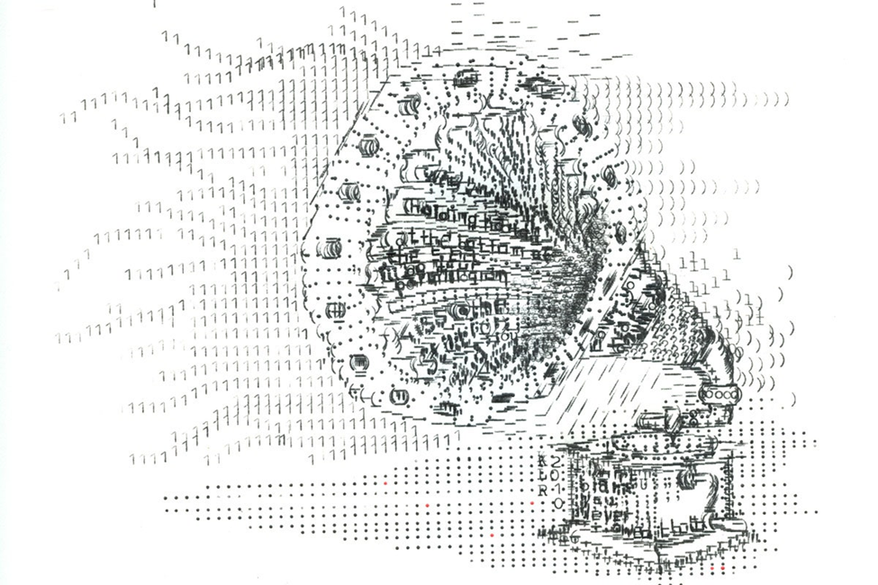

# Ascii Art and POLYMORPHISM!



The goals are to consolidate knowledge pertaining to:
1.	Java programming.
2.	The 3 pillars of Object-Oriented Programming (OOP) and their application in Java.
3.	Practice output formatting
      
In this lab you will explore the three pillars of object-oriented programming encapsulation, inheritance, and polymorphism. In addition, we will look at special formatting and escape sequences by creating your own text-based masterpieces (ascii art)!

## Setup

All java source code will be in the AsciiLab.Code package.  You should create new .java files for each class you write.

All java test code will be under test.java.AsciiLab.AsciiTest class.  There is a single test already written for you.  If it is runnable, then your environment has been set up correctly.


No other folders will need to be touched for this exercise.


## Instructions
### Step 1: creating the Ascii Class.
1. Right click on the '''AsciiLab''' package, and create a new class by navigating to new-> Java Class.
2. Name it "Ascii" and hit enter.
3. Double click the newly created class icon to open the editor.

4. Now it’s time write some code in our Ascii class by giving it some attributes.  Ascii doesn’t exist without a string representation, so let’s give it one field, a ```String``` called ```ascii```.  
5. We like to protect our data, so make it private.
6. But!  We may need to read it.  So make a getter method for ascii.
7. Awesome!  Now Let’s create the constructor.  Ascii doesn’t exist without its attribute defined, so let’s pass in a ```String``` called ```ascii``` to the constructor, and set it equal to our instance variable using the "this" syntax.

    ```
    this.ascii = ascii;
    ```
8. Finally, we want to view our ascii string by printing it.  Right now, our Ascii Object automatically inherits the ```toString()``` method from [Object].  That method prints the address location….which is not what we want.
9. Let’s write our own ```toString()``` method that overrides it with the power of POLYMORPHISM!
10. The method header should be a public method that returns a String called ```toString()```.  It takes in no parameters. Since this is an override method, don't forget the ```@Override``` tag.
11. We don’t call ```system.out.println``` directly here.   Instead, we create the string that will be printed when we call the method from anywhere.  Luckily, we’ve already done that!  It’s our ```ascii``` instance variable.  Return our instance variable.  Make sure you use the ```this``` keyword.
12. Great!  let's ```test``` it out.  Go into AsciiTest and create a new test method for toString called ```asciiToStringTest()```
13. Create a String object with whatever value you'd like, and an ```Ascii``` object, passing your string as the parameter.  Finally, use an ```assertEquals(String expected, String actual)``` to test your ```toString()``` method.
14. Hopefully your test passed!


## Step 2: Creating the Hand class

We are working towards making a Rock, Paper, Scissors game.  In order to do that, we have to create Hand Classes to hold our information.

1. Create a new class called ```Hand```, just like you did before.   
2. This time, we need to make it a subclass of Ascii.  In the class declaration add ```extends Ascii```.  You should see an error now complaining about a constructor.  All that means is that we have more work to do still.

3. In addition to our ```ascii string``` (which lives in the parent class), our ```Hand``` class needs to have a ```name``` (rock, paper, or scissors).  Give it an instance variable, a ```String``` called ```name```.
4. Now let’s write the constructor.  It should take in two parameters: ```String name```, and ```String ascii```.  The same error is still there, but it has moved to show at the constructor instead.  That’s okay.  Let’s keep going.
5. Remember that the first line that is implicitly called in any constructor is ```super()```.  That calls the constructor in the superclass (in this case ```Ascii```).  But!  Take another look at the constructor in ```Ascii```.  It’s not empty!  It takes in a parameter called ```ascii```.  So, we have to explicitly call it. This has to be the very first line in the constructor.

    ```
    super(ascii);
    ```

Now the error should be gone.

6. Finally, set the ```name``` instance variable to the ```name``` parameter.
7. Next, we need to make a ```toString()```.  By default, it will use the one defined in the ```Ascii``` class.  However, we also want to print out the ```name``` of our Hand.  Write your own ```toString()``` method that prints out the ```name``` of the hand on its own line, and then the ```ascii``` string on the next line.  Feel free to add formatting to the name to make it look pretty. 
8. It's an Override method so don't forget the ```@Override``` tag.
9. We can’t quite test it yet…. let’s keep going.

## Step 3: Rock
1.	Create a new class called Rock, just like you did before.  
2.	This time, we need to make it a subclass of ```Hand```.  In the class declaration, add ```extends Hand```.
3.	You see the same error! This time you should know how to solve it.  
         - We are going to practice overloading the constructor.  Make two constructors, one that takes in the fields as parameters, and one that does not.  For the one that does not, The name will always be "rock" and the string will always be an ascii picture.  Make sure that you are calling one from the other using the ```this``` keyword.  The only thing you need now, is an ascii representation of a rock hand.  Here you go!
```
     _.-.-.-.
    ;_|_|_|_|_
    |_|_|\__  \
    |    . '  |
    |   (    /
    \______/
```
4.	Now you have to turn it into something that can actually print correctly.  Remember that back slashes ```"\"``` are special escape characters that let us do hidden formatting.  They won’t print. Instead, we need to have a double backslash ```"\\"``` for it to print correctly.  You also need a new line character ```"\n"``` at the end of each line.  Remember that you can concatenate strings using the + operator.  Create a string that will print correctly (leaving the lines separated), and pass it to super along with the hand’s name.

5.  Create a new test in the test class so that you can run it easily.  For now, just print out the hand and visually inspect that it looks right. Since there is no assertEquals yet, it should pass automatically.  Once you are happy with how it looks, copy the following test into your code to make sure it is correct.  If it fails, pay special attention to the number of spaces at the beginning and end of each line.

          @Test
          public void rockTest(){
              //assertEquals(expected, actual);
              Hand rock = new Rock();
              System.out.println(rock);
              String expected = " _.-.-.-.\n;_|_|_|_|_\n|_|_|\\__  \\\n|    . '  |\n|   (    /\n \\______/";
      
              assertEquals(expected, rock.getAscii());
          }

    
## Step 4: Paper, Scissors
1. Repeat the instructions from ```Rock``` to make ```Paper``` and ```Scissors```.  
2. If you'd like, you can make tests and try printing your objects just like you did before.  

3. Here are the ascii strings:

```
        _______
  ____(____     \
 (________       |
(_________       |
 (________       |
  (___________  /
  ```

```
    .-.
    | |    / )
    | |   / /
    | |  / /
 _.-| |_/ /
; \( \   /
|\_)\ \  |
|    ) \ |
|   (    /
 \______/
```


4.  Here are the tests!

          @Test
          public void paperTest(){
              //assertEquals(expected, actual);
              Hand paper = new Paper();
              System.out.println(paper);
              String expected = "        _______\n  ____(____     \\\n (________       |\n(_________       |\n (________       |\n  (___________  /";
              assertEquals(expected, paper.getAscii());
          }
      
          @Test
          public void scissorsTest(){
              //assertEquals(expected, actual);
              Hand scissors = new Scissors();
              System.out.println(scissors);
              String expected = "    .-.\n    | |    / )\n    | |   / /\n    | |  / /\n _.-| |_/ /\n; \\( \\   /\n|\\_)\\ \\  |\n|    ) \\ |\n|   (    /\n \\______/";
              assertEquals(expected, scissors.getAscii());
          }


## Refining the architecture

1. Go back and look at your code with a critical eye.  Which, if any, of these classes should be marked as abstract?

2. Can apply the DRY Principle to any part of your code? (Don't Repeat Yourself.)
